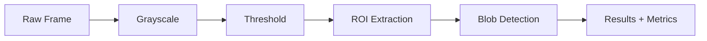
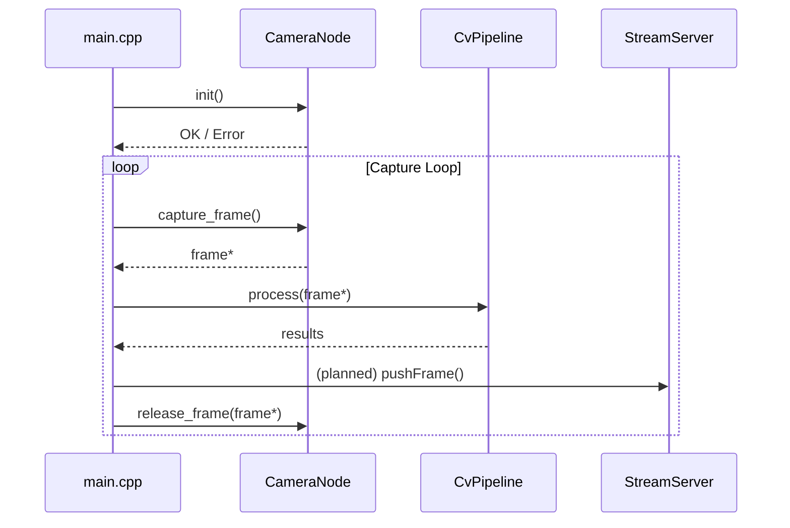

# CCM ESP32 Vision Node – Architecture (Updated & Expanded)

This document describes the complete architecture of the `ccm-esp32-vision-node` firmware, including
system behavior, modular components, data flow, constraints, and planned extensions.

---

# 1. Purpose of This Document
This file serves as the authoritative architectural reference for:
- Engineering leads evaluating CCMCode’s embedded‑vision approach
- Contributors extending the CvPipeline or StreamServer
- Anyone integrating this node into larger IoT/robotics systems

---

# 2. High‑Level System Overview
`ccm-esp32-vision-node` is a modular, real‑time ESP-IDF C++ firmware system that transforms an ESP32‑S3
camera board into an embedded vision node.

Primary responsibilities:
- Camera initialization and management
- Continuous frame capture
- Real‑time frame processing via **CvPipeline**
- Data publishing (UART logs, and future network streaming)
- Accurate profiling (FPS, per‑stage timing)

Core design principles:
- **Separation of concerns**
- **Predictable timing**
- **Zero‑copy operation when possible**
- **Extensibility for future CV stages**

---

# 3. Module Overview

```mermaid
flowchart LR
    subgraph HW[Hardware]
        CAM[Camera Sensor<br/>OV2640 / OV5640]
    end

    subgraph FW[Firmware Components]
        CN[CameraNode<br/>components/camera_node]
        CV[CvPipeline<br/>components/cv_pipeline]
        SS[StreamServer (Planned)<br/>components/stream_server]
        DRV[Drivers<br/>components/drivers]
        UT[Utils<br/>components/utils]
    end

    CAM --> CN --> CV --> SS
    CV --> UT
    CN --> UT
```

---

# 4. Component Responsibilities

## 4.1 CameraNode
A C++ abstraction over the official `esp32-camera` component.

Responsibilities:
- Camera pin configuration
- Sensor init (clock, pixel format, frame size)
- Frame acquisition (`esp_camera_fb_get`)
- Frame release (`esp_camera_fb_return`)
- Exposure and grab‑mode configuration
- Error reporting

Interface:
```cpp
bool init();
camera_fb_t* capture_frame();
void release_frame(camera_fb_t* fb);
```

---

## 4.2 CvPipeline
A configurable, extensible classical‑CV pipeline for microcontrollers.

Responsible for:
- Grayscale conversion
- Thresholding
- ROI extraction
- Blob detection (future)
- Per‑stage profiling
- Optional downsampling
- Emitting lightweight detection metadata

Pipeline model:



---

## 4.3 StreamServer (Planned)
Provides an ESP-IDF HTTP server with:
- MJPEG stream (`/stream`)
- Raw frame endpoint (`/frame`)
- JSON telemetry (`/status`)
- Optional overlay debugging

Design considerations:
- Must not block the capture loop
- Avoid full-frame copies
- Maintain stable FPS under streaming load

---

## 4.4 Utils and Drivers
Provide:
- Logging wrappers
- FPS measurement tools
- Board pin mapping
- Memory diagnostics
- Binary/ASCII helpers for debugging

---

# 5. Main Application Flow

The `firmware/main` module orchestrates system behavior:

1. Initialize logging + timers
2. Configure and initialize CameraNode
3. Enter the capture loop
4. For each frame:
   - Acquire frame
   - Process through CvPipeline
   - Publish results (UART / future StreamServer)
   - Release frame buffer
5. Repeat at target FPS

This architecture mirrors higher‑power embedded vision stacks but optimized for MCU limits.

---

# 6. Data Flow Diagram (Detailed)

```mermaid
flowchart LR
    A[Sensor Exposure] --> B[DMA → Frame Buffer]
    B --> C[CameraNode::capture_frame()]
    C --> D[CvPipeline::process()]
    D -->|Detections + FPS| E[UART Logs]
    D -->|Future MJPEG| F[StreamServer]
    E --> G[Developer / Host]
    F --> H[Remote Dashboard]
```

---

# 7. Boot → First Frame: Sequence Diagram



---

# 8. Performance Constraints

## 8.1 RAM / PSRAM
ESP32-S3 internal RAM is limited; frame buffers must reside in PSRAM for:
- VGA frames
- Multi-stage pipelines
- Future MJPEG encoding

Guidelines:
- Avoid frame copying
- Reuse static buffers for intermediate stages
- Minimize temporary allocations

---

## 8.2 Timing / Latency
Target performance:

| Resolution | Expected FPS |
|-----------|--------------|
| QVGA      | 15–20 FPS    |
| VGA       | 5–12 FPS     |

Each pipeline stage logs:
- Start timestamp
- End timestamp
- Duration in microseconds

This enables transparent, real‑time profiling and tuning.

---

# 9. Error Handling & Diagnostics

- Camera initialization failures: fatal
- Frame capture failures: skip frame, log warning
- Slow-frame warnings: highlighted in logs
- Future: `/status` endpoint includes:
  - heap usage
  - error counters
  - average FPS
  - per-stage timings

---

# 10. Planned Future Extensions

## 10.1 Configurable Pipelines
Loadable pipeline configuration (JSON or struct):

```json
{
  "grayscale": true,
  "threshold": true,
  "roi": { "x": 50, "y": 40, "w": 180, "h": 180 },
  "blob": true
}
```

## 10.2 Additional Output Backends
- Buffered UART binary streaming
- MQTT
- WebSocket for control messages

## 10.3 TinyML Stage (Optional)
Support for extremely compact embedded inference:
- 96×96 CNNs
- FOMO-style detection (Edge Impulse)
- Post-threshold classification

---

# 11. Summary

This architecture enables the ESP32‑S3 to act as a **fully functional embedded vision node**, capable of
preprocessing, analysis, and eventually streaming. It is modular, extensible, and designed for real-time
operation under microcontroller constraints.

