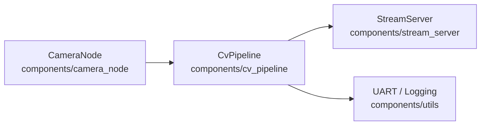

# Architecture – ccm-esp32-vision-node

This project is organised as a set of ESP-IDF components to keep camera I/O,
processing, and streaming responsibilities cleanly separated.

---

## Components

### **CameraNode**
Owns camera configuration and frame acquisition via the `esp32-camera` managed component.  
Responsible for:
- camera pin configuration  
- sensor initialization  
- frame buffer acquisition & release  
- controlling resolution, format, grab mode  

---

### **CvPipeline**
Processes frames (grayscale, thresholding, ROI, simple filters).  
Designed to be modular so stages can be swapped or reordered.  
Later this will include:
- basic preprocessing  
- simple blob detection  
- region masking  
- profiling hooks  

---

### **StreamServer** *(planned)*
Exposes frames over Wi-Fi, either as:
- MJPEG HTTP stream  
- Raw frame endpoint  
- Debug overlay with FPS  

Useful for edge monitoring and remote debugging.

---

### **Utils / Drivers**
Provides:
- lightweight logging
- timing & FPS measurement
- board-specific pin setup
- reusable helpers

This keeps noise out of the main components.

---

## Main Application

The `firmware/main` app wires all components together:

1. Initialize the camera  
2. Capture frames in a loop  
3. Pass frames into `CvPipeline`  
4. Forward processed frames or metadata to `StreamServer` *(when implemented)*  
5. Output timing/debug info via UART  

This layered structure mirrors real-world embedded vision systems and keeps the project modular and maintainable.
